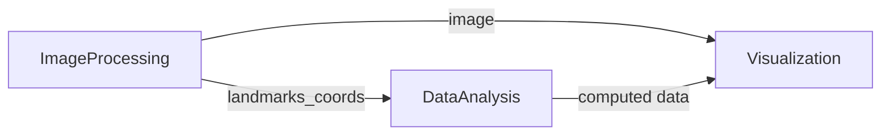

# Body fatigue detection
Detection fatigue in front of the computer based on some signs, such as blinking rate, yawning, shoulder and head positions etc. Input data come frome the frontal camera. 
 
The system is designed as a distributed with services that can (but don't have to) be run on different machines. 
Currently there are three main services: **Image processing, Data analysis and visualization**. 
In the target version the entire system i.e. the number and type of used service and communication protocols will be configurable by config file.

## Image processing
Service that is an entry point to the system. Gathers frames from camera, runs Google MediaPipe models (pose and face) and sends frames and detected landmarks to further analysis and visualization. 
>TechStack: Python, OpenCV, mediapipe, numpy

## Data analysis
Receives detected landmarks and based on their analysis identifies sings of fatigue (blinking, yawn, shoulder and head position). 
>TechStack: Rust, tonic, tokio, serde, async

## Visualization
Visualization layer that only shows data like image and fatigue infos from other services. 
>TechStack: C++, Qt, OpenCV, nlohmann

## Communication
Current message flow:

All messages are defined and serialized using protobuf. 
Messages definition directory: [protos](/proto/alerts.proto) 
Used communication protocol and endpoints are defined in [config.json](/config.json) 

##### Supported middleware
- grpc

## Setup
TODO

## Development status
- Docker images - ✅
- gRPC communication - ✅
- Pose landmarks - ✅
- Face landmarks- ✅
- Basic visualization - ✅
- Shoulders analysis - ✅
- Blinking detecion - ONGOING
- Yawn detecion - TODO
- Head position - TODO
- Fatigue analysis - TODO
- Different communication types - TODO
- Support video file input- TODO